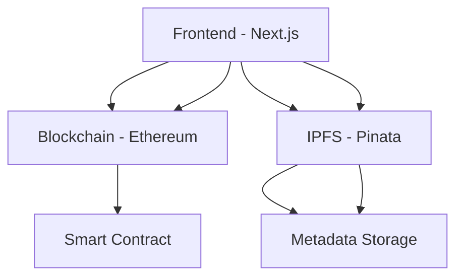
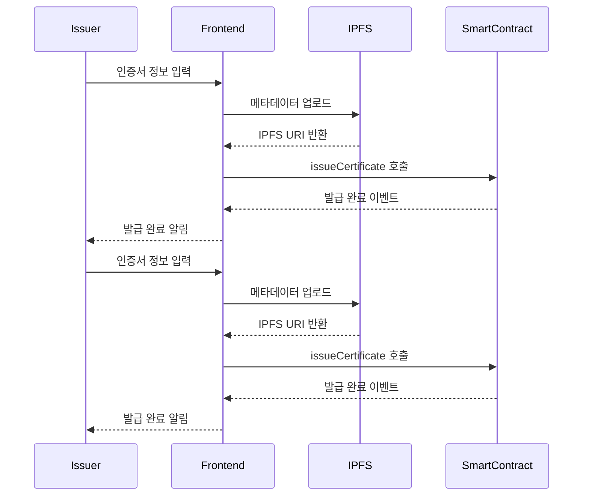
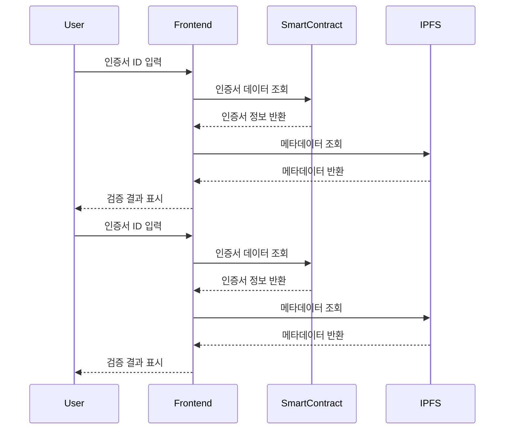

# iLoveCert 아키텍처

## 시스템 아키텍처



## 핵심 컴포넌트
## 핵심 컴포넌트

### 1. 프론트엔드 (Next.js 14)
```
frontend/
├── src/
│   ├── app/                    # Next.js 14 App Router
│   │   ├── page.tsx           # 메인 페이지
│   │   ├── new/              # 인증서 발급
│   │   └── certificate/[id]/  # 인증서 상세
│   ├── components/
│   │   ├── providers.tsx      # Web3 & 전역 프로바이더
│   │   └── certificate/       # 인증서 관련 컴포넌트
│   ├── hooks/                # 커스텀 훅
│   │   ├── use-certificates.ts
│   │   └── use-certificate-form.ts
│   └── types/                # 타입 정의
│   ├── app/                    # Next.js 14 App Router
│   │   ├── page.tsx           # 메인 페이지
│   │   ├── new/              # 인증서 발급
│   │   └── certificate/[id]/  # 인증서 상세
│   ├── components/
│   │   ├── providers.tsx      # Web3 & 전역 프로바이더
│   │   └── certificate/       # 인증서 관련 컴포넌트
│   ├── hooks/                # 커스텀 훅
│   │   ├── use-certificates.ts
│   │   └── use-certificate-form.ts
│   └── types/                # 타입 정의
```

#### 주요 기능:
- Web3 지갑 연동 (MetaMask)
- 인증서 발급 및 관리
- 인증서 검증
- IPFS 메타데이터 관리
- 인증서 발급 및 관리
- 인증서 검증
- IPFS 메타데이터 관리

### 2. 스마트 컨트랙트 (Solidity)
### 2. 스마트 컨트랙트 (Solidity)
```
contracts/
├── contracts/
│   └── CertificateContract.sol
│   └── CertificateContract.sol
├── scripts/
│   └── deploy.js
└── test/
    └── CertificateContract.test.js
    └── CertificateContract.test.js
```

#### 핵심 기능:
#### 핵심 기능:
- 인증서 발급 및 저장
- 발급자 권한 관리
- 발급자 권한 관리
- 인증서 유효성 검증
- 인증서 메타데이터 관리
- 인증서 메타데이터 관리

## 데이터 흐름

### 1. 인증서 발급 프로세스
### 1. 인증서 발급 프로세스


### 2. 인증서 검증 프로세스
### 2. 인증서 검증 프로세스


## 보안 설계

### 1. 스마트 컨트랙트
- OpenZeppelin의 Ownable, AccessControl 패턴 적용
- 권한 기반 접근 제어
- 이벤트 로깅을 통한 추적성 확보

### 2. 프론트엔드
- 환경 변수를 통한 민감 정보 관리
- 사용자 입력 데이터 검증
- 메타마스크 연동 상태 관리

### 3. 데이터 저장
- IPFS를 통한 메타데이터 분산 저장
- 블록체인의 불변성을 활용한 데이터 신뢰성 확보
## 보안 설계

### 1. 스마트 컨트랙트
- OpenZeppelin의 Ownable, AccessControl 패턴 적용
- 권한 기반 접근 제어
- 이벤트 로깅을 통한 추적성 확보

### 2. 프론트엔드
- 환경 변수를 통한 민감 정보 관리
- 사용자 입력 데이터 검증
- 메타마스크 연동 상태 관리

### 3. 데이터 저장
- IPFS를 통한 메타데이터 분산 저장
- 블록체인의 불변성을 활용한 데이터 신뢰성 확보

## 확장성 고려사항

### 1. 스마트 컨트랙트
- 업그레이드 가능한 프록시 패턴 적용 가능
- 가스 비용 최적화
- 다중 체인 지원 가능성

### 2. 프론트엔드
- 모듈화된 컴포넌트 구조
### 1. 스마트 컨트랙트
- 업그레이드 가능한 프록시 패턴 적용 가능
- 가스 비용 최적화
- 다중 체인 지원 가능성

### 2. 프론트엔드
- 모듈화된 컴포넌트 구조
- 상태 관리 최적화
- 다국어 지원 확장 가능

### 3. 저장소
- 대체 IPFS 게이트웨이 지원
- 메타데이터 캐싱 전략
- 백업 저장소 구성 가능

## 성능 최적화

### 1. 프론트엔드
- Next.js의 서버 컴포넌트 활용
- 이미지 최적화
- 코드 스플리팅

### 2. 스마트 컨트랙트
- 가스 최적화
- 이벤트 인덱싱
- 배치 처리 지원

### 3. IPFS
- 게이트웨이 캐싱
- 메타데이터 최적화
- 병렬 업로드 처리