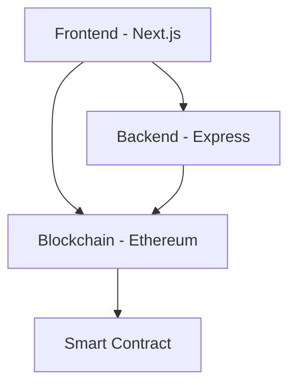
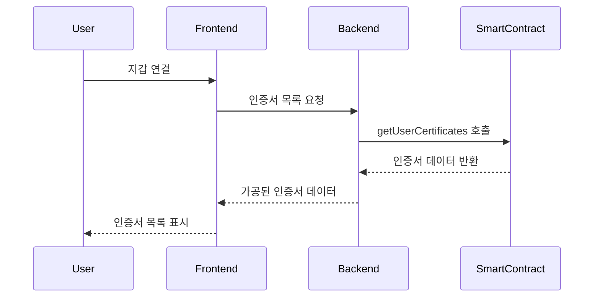
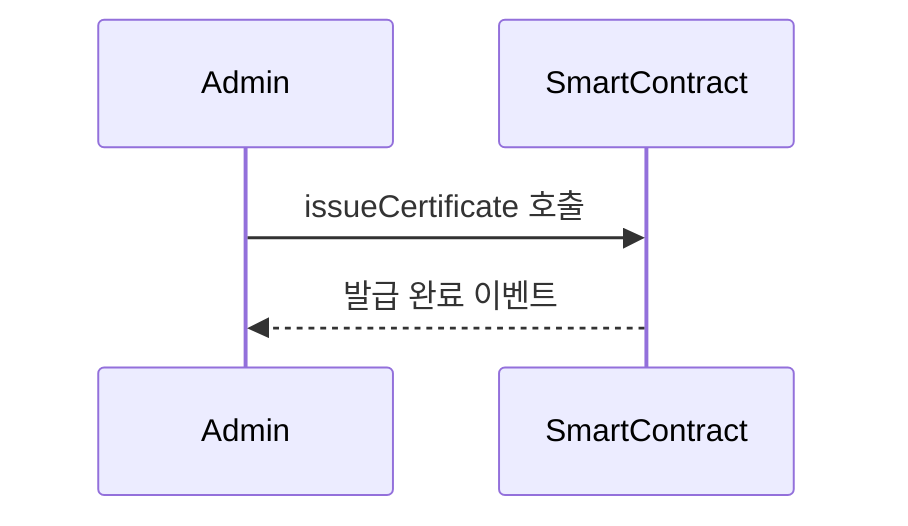

# iLoveCert 아키텍처

## 시스템 아키텍처



## 컴포넌트 구조

### 1. 프론트엔드 (Next.js 14)
```
frontend/
├── src/
│   ├── app/                # Next.js 14 App Router
│   │   ├── layout.tsx     # 기본 레이아웃
│   │   └── page.tsx       # 메인 페이지
│   ├── components/        # React 컴포넌트
│   │   ├── providers.tsx  # Web3 & Query 프로바이더
│   │   └── certificate/   # 인증서 관련 컴포넌트
│   └── hooks/            # 커스텀 훅
```

#### 주요 기능:
- Web3 지갑 연동 (MetaMask)
- 인증서 목록 조회 및 표시
- 실시간 인증서 상태 업데이트

### 2. 백엔드 (Express)
```
backend/
├── src/
│   ├── index.ts          # 메인 서버
│   ├── contract.ts       # 컨트랙트 ABI
│   └── types.ts          # 타입 정의
```

#### API 엔드포인트:
- GET /api/certificates/:address
- GET /api/certificate/:id

#### 주요 기능:
- 블록체인 데이터 조회 및 가공
- 인증서 메타데이터 관리
- API 엔드포인트 제공

### 3. 스마트 컨트랙트 (Solidity)
```
contracts/
├── contracts/
│   └── CertificateStorage.sol
├── scripts/
│   └── deploy.js
└── test/
    └── CertificateStorage.test.js
```

#### 주요 기능:
- 인증서 발급 및 저장
- 인증서 유효성 검증
- 인증서 취소 기능

## 데이터 흐름

1. 인증서 조회 프로세스:


2. 인증서 발급 프로세스:


## 보안 고려사항

1. 스마트 컨트랙트
- Ownable 패턴 사용
- 인증서 발급 권한 제한
- 상태 변경 함수 접근 제어

2. 백엔드
- 환경 변수 보안
- API 요청 검증
- 에러 핸들링

3. 프론트엔드
- 환경 변수 관리
- 사용자 입력 검증
- Web3 연결 상태 관리

## 확장성 고려사항

1. 스마트 컨트랙트
- 업그레이드 가능한 구조
- 가스 최적화
- 이벤트 로깅

2. 백엔드
- 모듈화된 구조
- 캐싱 레이어 추가 가능
- 확장 가능한 API 구조

3. 프론트엔드
- 컴포넌트 재사용성
- 상태 관리 최적화
- 동적 UI 업데이트 